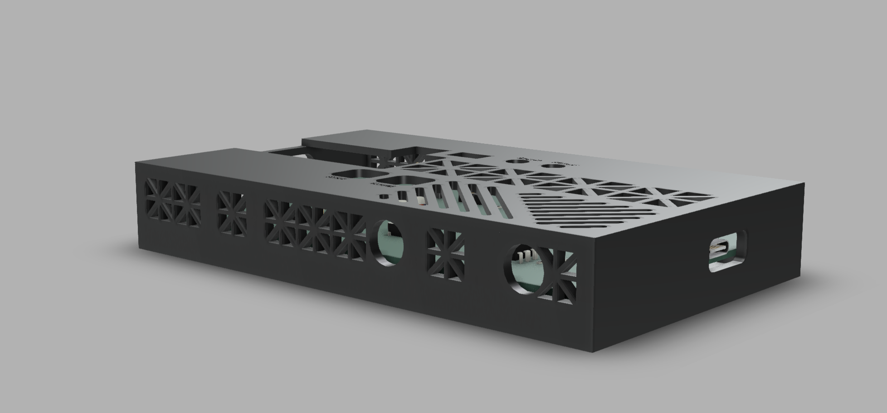
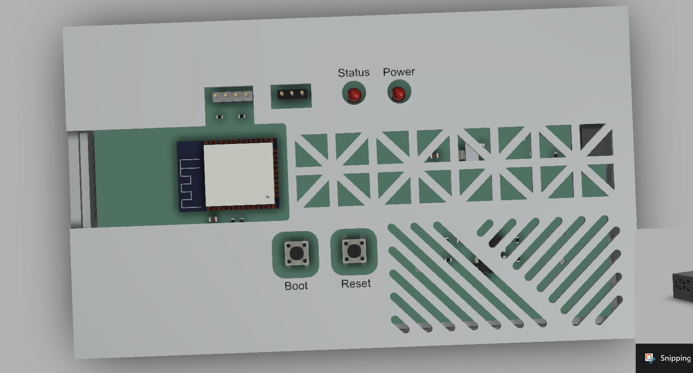

# Home Energy Monitor

**A custom PCB that measures real-time household power consumption (Watts, apparent power (VA), and power factor) and streams live data to an OLED screen, a WiFi dashboard, and a Modbus TCP/IP server (the same protocol real industrial power meters use).**


---

## Schematic Preview


---

## PCB Preview


## Enclosure Preview




---

## What It Does

Non-invasive current transformer (CT) sensors clip around household wires inside a breaker box(does not touch any live wires). The custom PCB conditions the signal from the sensors and feeds it to an ESP32 microcontroller. The microcontroller then samples the voltage and current to compute:

- **Real Power (Watts)** 
- **Apparent Power (VA)**
- **Power Factor** 
- **Cumulative kWh** 

The readings come out three ways: a small OLED on the device, a live dashboard served over WiFi that you can open in any browser, and a Modbus TCP/IP server so industrial software like PLCs, SCADA, or Home Assistant can read the meter directly.

---

## How It Works

The SCT-013 current clamp outputs a small AC signal that mirrors the current in the wire it's clamped around. Before the ESP-32 is able to sample the signal, it must condition it. 

1. **It swings negative** — the ESP32 ADC only reads 0–3.3V. An op-amp bias circuit lifts the signal to a 1.65V midpoint so it never goes below 0V.
2. **It's in the wrong units** — a burden resistor converts current to a readable voltage via Ohm's Law (V = I × R).
3. **It carries noise** — an RC low-pass filter passes 60Hz but blocks high-frequency interference.

The ESP32 samples the signal and calculates RMS values in firmware and then uses those measurements to produce real power, apparent power, and power factor. 

---

## Modbus TCP/IP

I added a Modbus TCP server so this works more like a real industrial power meter instead of just a hobby project. Modbus is the protocol that commercial meters from companies like Schneider Electric and ABB use to send their readings to building systems and SCADA software. I got the idea from a PLC Dojo certification I finished on programming Modbus TCP clients and servers, and I wanted to actually use what I learned on my own hardware.

The ESP32 runs the Modbus server on port 502 at the same time as the web dashboard on port 80, so both run off the same WiFi. Any Modbus client, like a PLC, SCADA software, Home Assistant, Node-RED, or even a Python script, can read the meter by asking for its holding registers with Function Code 3.

Modbus registers can only hold 16-bit whole numbers, so I scale the decimal readings into whole numbers before writing them, and the client divides by the same number to get the real value back.

| Register | Modbus Address | Value | Scaling | Example |
|---|---|---|---|---|
| 0 | 40001 | Voltage (Vrms) | ×10 | `1200` → 120.0 V |
| 1 | 40002 | Current CH1 (Irms) | ×100 | `500` → 5.00 A |
| 2 | 40003 | Real Power CH1 (W) | ×1 | `600` → 600 W |
| 3 | 40004 | Apparent Power CH1 (VA) | ×1 | `650` → 650 VA |
| 4 | 40005 | Power Factor | ×100 | `92` → 0.92 |
| 5 | 40006 | Total Energy (kWh) | ×10 | `123` → 12.3 kWh |
| 6 | 40007 | Current CH2 (Irms) | ×100 | `300` → 3.00 A |
| 7 | 40008 | Real Power CH2 (W) | ×1 | `360` → 360 W |

> Register 0 in the code shows up as 40001 in most Modbus software. The 4xxxx numbering is just the standard way holding registers get labeled.

---

## Hardware

> Prices are what you actually pay per order, not per component. Amazon prices fluctuate — check links for current pricing. Order DigiKey items together to share one shipping fee (~$8 flat).

| Component | Ref | Need | What to Buy | Pack | Est. Order Price | Where |
|---|---|---|---|---|---|---|
| ESP32-WROOM-32 module | U1 | 1 | ESP-WROOM-32D 5-pack | 5 | ~$16 | [Amazon][(https://www.amazon.com/ESP-WROOM-32D-ESP-32-Bluetooth-Module-ESP32-WROOM-32D/dp/B085BNHPW5)](https://www.amazon.com/DORHEA-ESP-WROOM-32D-Bluetooth-integrates-ESP32-D0WD/dp/B08XXH9RMT/ref=sr_1_4?crid=1PAA57ZDBXXKA&dib=eyJ2IjoiMSJ9._MntEg_yRxGkBw1EfxLq6cc-w3Tk4YEgtB1QtlP6Z4yxtTF4Fgfk1zGfVmxLEI5m1rj4c-1jFTGRVePtGjaZB-u8IC_M2NuE5i72-Z6dyDMhy--t0tJ7uNgECgIogId0cCfDd5HPa67FyROcsTOtQSfSzK0LDP2i9msGrrE8LXcygPlws7SA2oZ1K6vlKAqsIRbaACC8jXyDBxBi5YwBBB_2cBgjYlD-LvbD8llQCdCVJK7sxuom2wjza4DP2pI0dcSs2QY-L5haReDtaOngVqGGzxCfWKOjql3sHXlfzxA.qUdqsXgRGlyqVaLIAANpF-NeytYFG2HdsdXi1yK_r4c&dib_tag=se&keywords=ESP-WROOM-32D%2BESP32%2B2.4GHz%2BDual-Mode%2BBluetooth%2Band%2BWiFi%2BLow%2BPower%2BModule&nsdOptOutParam=true&qid=1783296447&s=electronics&sprefix=esp-wroom-32d%2Besp32%2B2.4ghz%2Bdual-mode%2Bbluetooth%2Band%2Bwifi%2Blow%2Bpower%2Bmodule%2Celectronics%2C220&sr=1-4&th=1) |
| CT sensor SCT-013-000 (100A) | J1, J2 sensors | 2 | KOOBOOK 2-pack | 2 | ~$15 | [Amazon](https://www.amazon.com/KOOBOOK-SCT-013-000-Non-invasive-Current-Transformer/dp/B07S4G2Y27) |
| ZMPT101B voltage sensor module | J6 sensor | 1 | Single module | 1 | ~$8 | Amazon |
| Op-amp MCP6002 DIP-8 | U2 | 1 | Juried Engineering 1-pack | 1 | ~$4 | [Amazon](https://www.amazon.com/MICROCHIP-MCP6002-I-MCP6002-Operational-Amplifier/dp/B07GMWJ523) |
| Voltage regulator AMS1117-3.3 | U3 | 1 | 10-pack SOT-223 | 10 | ~$6 | [Amazon](https://www.amazon.com/AMS1117-3-3-LM1117-SOT-223-Voltage-Regulator/dp/B00Y5EKAU2) |
| SMD resistors 0603 (33Ω, 10kΩ, 4.7kΩ, 5.1kΩ, 150Ω) | R1–R14 | 14 total | 0603 assortment kit — covers all 5 values | 660pc / 33 values | ~$9 | [Amazon](https://www.amazon.com/660pcs-0603-Resistors-Assortment-Values/dp/B0CH2XD7JY) |
| SMD capacitors 0603+0805 (100nF, 10µF) | C1–C9 | 9 total | 0603/0805 assortment kit (10pF–22µF) | 960pc / 16 values | ~$10 | [Amazon](https://www.amazon.com/Capacitor-10pF-22uF-Multilayer-Capacitors-Assortment/dp/B094Z9V5KK) |
| 3.5mm audio jack SMT (CUI SJ-3523-SMT) | J1, J2 | 2 | Order 2 individually | 2 | ~$5 | [DigiKey](https://www.digikey.com/en/products/detail/same-sky-formerly-cui-devices/SJ-3523-SMT-TR/281297) |
| USB-C receptacle (GCT USB4085-GF-A) | J4 | 1 | Order 1 individually | 1 | ~$1 | [DigiKey](https://www.digikey.com/en/products/detail/gct/USB4085-GF-A/9859662) |
| 3mm LED (red or green) | D1, D2 | 2 | 10-pack | 10 | ~$5 | [Amazon](https://www.amazon.com/3mm-Round-Top-Red-LED/dp/B017TR4XWW) |
| Tactile button 6×6×4.3mm THT | SW1, SW2 | 2 | 10-pack | 10 | ~$5 | [Amazon](https://www.amazon.com/6x6x4-3mm-Momentary-Tactile-Button-Through/dp/B00EDJYK46) |
| 2.54mm male pin headers (J3 4-pin, J5 6-pin, J6 3-pin) | J3, J5, J6 | 13 pins | 40-pin breakable strip (snap to length) | 10×40 strips | ~$6 | [Amazon](https://www.amazon.com/MCIGICM-Header-2-45mm-Arduino-Connector/dp/B07PKKY8BX) |
| SSD1306 OLED 0.96" I2C | J3 display | 1 | Single unit | 1 | ~$7 | [Amazon](https://www.amazon.com/SSD1306-Display-128x64-Driver-Screen/dp/B0GRGLP6WW) |
| CP2102 USB-to-UART programmer (to flash via J5) | — | 1 | HiLetgo CP2102 | 1 | ~$7 | [Amazon](https://www.amazon.com/HiLetgo-CP2102-Converter-Adapter-Downloader/dp/B00LODGRV8) |
| PCB fabrication | — | 1 run | JLCPCB 5 boards + shipping | 5 boards | ~$20 | [JLCPCB](https://jlcpcb.com) |
| Enclosure | — | 1 | 3D printed PETG-CF | — | $0 | filament on hand |
| DigiKey shipping | — | — | Flat rate (order SJ-3523 + USB4085 together) | — | ~$8 | — |
| **Total** | | | | | **~$132** | |

---

## Repository Structure

```
home-energy-monitor/
├── hardware/        # KiCad schematic, PCB layout, Gerber files
├── firmware/        # ESP32 Arduino code
├── enclosure/       # FreeCAD source + STL files for 3D printing
└── docs/
    └── photos/      # Build progress photos
```

---

## Build Log

| Date | Milestone |
|---|---|
| June 10, 2026 | Project started. Repository initialized. |
| June 11, 2026 | KiCad schematic started — analog front-end both CT channels complete |
| June 13, 2026 | KiCad schematic complete — ERC passes clean, all components wired |
| June 14, 2026 | PCB layout complete — all components placed, routed, ground plane poured, DRC clean |
| June 14, 2026 | Gerbers exported and committed — ready for JLCPCB upload |
| June 14, 2026 | Firmware written — RMS sampling, power math, OLED display, kWh accumulator. Verified on Wokwi simulator. |
| June 15, 2026 | WiFi dashboard complete — ESP32 serves live readings over HTTP, JavaScript polls every second |
| June 16, 2026 | 3D enclosure designed by [@hummos430](https://github.com/hummos430) in Fusion 360 — files committed |
| June 16, 2026 | Stardance funding submitted — S tier $150 |
| July 3, 2026 | DRC audit fixes — solid B.Cu ground plane added, ESP32 thermal via drills fixed, USB-C clearance rule corrected. ERC + DRC verified 0 errors. Gerbers re-exported — board ready to order |
| July 8, 2026 | Modbus TCP/IP server added — ESP32 exposes 8 holding registers on port 502, runs alongside the web dashboard |
| — | PCBs ordered from JLCPCB |
| — | PCBs arrived, soldering complete |
| — | Firmware calibrated, first real power readings |
| — | Dashboard live, full system working |

---

## Simulation

Test the firmware logic without hardware — runs in browser:

[](https://wokwi.com/projects/466868484916087809)

Simulates dual CT sensor readings, RMS power math, serial output, and OLED display on a virtual ESP32. CH1 uses test values (120V, 5A, 550W, PF 0.92) to verify the signal chain and kWh accumulator logic.

---

## Status

- [x] KiCad schematic — ERC clean (0 errors)
- [x] PCB layout — DRC clean (0 violations, 0 unconnected); B.Cu ground plane added
- [x] Gerbers exported from the DRC-clean board — ready for JLCPCB upload
- [x] Firmware — ADC sampling + RMS math
- [x] Firmware — power factor calculation
- [ ] PCB fabrication (JLCPCB)
- [x] 3D enclosure design
- [x] WiFi dashboard
- [x] Modbus TCP/IP server (8 holding registers, Function Code 3)
- [ ] Full system test

---

## Acknowledgements

- **[@hummos430](https://github.com/hummos430)** — Designed and 3D printed the enclosure in Fusion 360
- **[Claude (Anthropic)](https://claude.ai)** — Claude was used to help document this project. I often recorded voice notes describing my engineering ideas, design decisions, and progress, then used Claude to organize those notes into structured GitHub documentation and tables. It also helped review the BOM and sanity-check component selections for consistency. The schematic, PCB layout, firmware, testing, and engineering decisions are my own.

---

## License

MIT — use, modify, share freely. See [LICENSE](LICENSE).
