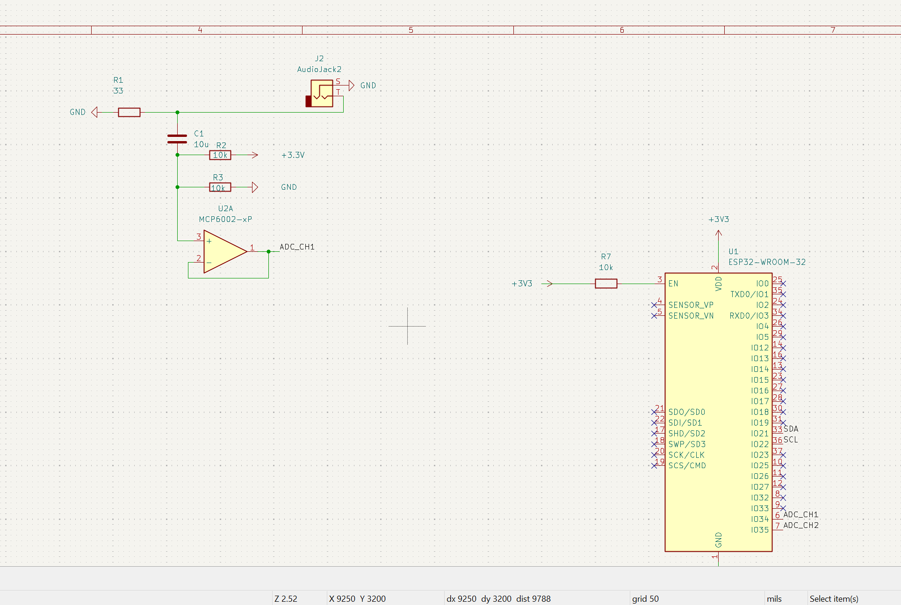

# Hardware

Custom 2-layer PCB designed in KiCad 9. Measures real-time household power consumption using non-invasive current transformer sensors.

---

## PCB Specifications

| Spec | Value |
|---|---|
| Layers | 2 (F.Cu / B.Cu) |
| Board dimensions | ~130mm × 75mm |
| Min trace width | 0.2mm signal / 0.4mm power |
| Min clearance | 0.15mm (accommodates the USB-C footprint's pad spacing; JLCPCB handles down to 0.127mm) |
| Copper pour | GND flood on F.Cu + solid GND plane on B.Cu, joined by stitching vias |
| Via drill | 0.3mm min |
| Surface finish | HASL (lead-free) |
| Fabrication | JLCPCB |

---

## Design Overview

### Power Path
USB-C (5V VBUS) → AMS1117-3.3 linear regulator → 3.3V rail → ESP32 + all peripherals

CC1 and CC2 resistors (5.1kΩ to GND) identify the board as a USB device to the host charger, enabling 5V/500mA delivery per USB-C spec.

### CT Sensor Signal Conditioning (per channel)
Each channel processes the AC output of an SCT-013-000 current transformer:

```
SCT-013 → 33Ω burden resistor → 10µF coupling cap → MCP6002 op-amp buffer → ESP32 ADC
                                    ↑
                          10kΩ/10kΩ bias divider (1.65V midpoint)
```

1. **Burden resistor (33Ω):** The SCT-013 outputs a small currecnt but the ESP32 measures the voltage. The 33 ohm burden resisotr converts that currecnt into a voltage using Ohm's law. At the senors's max rated current, this produeces 1.65 V RMS 2.33 V peak. 

2. **Bias divider (2× 10kΩ):** Becuase the ESP32 ADC can't read negative voltages, 2 10k ohm resistors create a 1.65 V bais point.
3. **Coupling capacitor (10µF):** Blocks DC from the burden resistor, and passes the 60Hz AC signal.
4. **MCP6002 buffer:** Unity-gain op-amp buffer to keep the bais network independent from the ESP32 ADC. Its high imput impedance prevents the bais voltage from shifting. 

### Voltage Sensing
ZMPT101B voltage transformer connects to J6. its output is routed to GPIO36 which is an input-only ADC pin with no internal pull resistors, chosen to minimize noise on the analog signal.

### I2C Bus
SDA (GPIO21) and SCL (GPIO22) pulled up to 3.3V via 4.7kΩ resistors. Pull-up value chosen for standard-mode I2C (100 kHz) with expected bus capacitance under 50pF.

### ESP32 Boot Circuit
- EN pulled high via 10kΩ (R7) + 100nF to GND for clean power-on reset
- GPIO0 pulled high via 10kΩ (R10); SW2 pulls GPIO0 low for bootloader entry
- SW1 pulls EN low for hard reset

---

## Schematic

See [`Microgrid-Home-Energy-Monitor.kicad_sch`](Microgrid-Home-Energy-Monitor.kicad_sch)



---

## PCB Layout

See [`Microgrid-Home-Energy-Monitor.kicad_pcb`](Microgrid-Home-Energy-Monitor.kicad_pcb)

Key layout decisions:
- Analog front-end (J1, J2, U2, bias resistors) grouped bottom-right, away from ESP32 WiFi antenna
- ESP32 antenna overhangs the keepout zone — no copper pour under antenna area
- AMS1117 decoupling caps (C3–C6) placed within 2mm of regulator pins
- ESP32 VDD decoupling (C7, C8) placed directly below VDD pin
- USB-C connector (J4) edge-mounted on right wall for direct cable access
- Ground pour floods entire F.Cu layer

---

## Bill of Materials

| Ref | Component | Value | Package | MPN | Supplier |
|---|---|---|---|---|---|
| U1 | ESP32-WROOM-32 | — | Module | ESP32-WROOM-32E-N4 | Mouser 356-ESP32WROOM32EN4 |
| U2 | MCP6002 Op-Amp | — | DIP-8 | MCP6002-I/P | Digikey MCP6002-I/P-ND |
| U3 | AMS1117-3.3 | 3.3V LDO | SOT-223 | AMS1117-3.3 | Digikey 1665-1016-1-ND |
| J1, J2 | CT Sensor Input | 3.5mm jack | SMD | SJ-3523-SMT | Digikey CP-3523SJCT-ND |
| J3 | OLED Connector | 4-pin | 2.54mm header | — | generic |
| J4 | USB-C Receptacle | USB 2.0 | SMD 16P | GCT USB4085-GF-A | Digikey 2073-USB4085-GF-ACT-ND |
| J5 | Programming Header | 6-pin | 2.54mm header | — | generic |
| J6 | ZMPT101B Connector | 3-pin | 2.54mm header | — | generic |
| R1, R2 | Burden Resistor | 33Ω 1% | 0603 | — | generic |
| R3–R6 | Bias Resistor | 10kΩ | 0603 | — | generic |
| R7 | EN Pull-up | 10kΩ | 0603 | — | generic |
| R8, R9 | I2C Pull-up | 4.7kΩ | 0603 | — | generic |
| R10 | GPIO0 Pull-up | 10kΩ | 0603 | — | generic |
| R11, R12 | CC Pull-down | 5.1kΩ | 0603 | — | generic |
| R13, R14 | LED Current Limit | 150Ω | 0603 | — | generic |
| C1, C2 | Coupling Cap | 10µF | 0805 | — | generic |
| C3, C6 | LDO Bulk Cap | 10µF | 0805 | — | generic |
| C4, C5 | LDO Bypass Cap | 100nF | 0603 | — | generic |
| C7 | ESP32 Bypass | 100nF | 0603 | — | generic |
| C8 | ESP32 Bulk | 10µF | 0805 | — | generic |
| C9 | EN Filter Cap | 100nF | 0603 | — | generic |
| D1 | Power LED | Red | 5mm THT | — | generic |
| D2 | Status LED | Green | 5mm THT | — | generic |
| SW1 | Reset Button | — | 6mm THT | — | generic |
| SW2 | Boot Button | — | 6mm THT | — | generic |
| CT1, CT2 | CT Sensor | SCT-013-000 | Clamp | SCT-013-000 | Amazon/AliExpress |
| VT1 | Voltage Sensor Module (plugs into J6) | ZMPT101B | Module | ZMPT101B | Amazon/AliExpress |

---

## Design Verification

All fixes from the 2026-07-02 DRC audit are complete (verified with `kicad-cli`):

- **ERC: 0 errors.** **DRC: 0 violations, 0 unconnected items.**
- GND split-pour islands eliminated by adding a solid B.Cu ground plane with stitching
  vias — front pour fragments all tie to it, so pinch-offs can't strand a ground pin
- ESP32 thermal vias enlarged to 0.3mm drill (JLCPCB 2-layer minimum)
- Minimum clearance set to 0.15mm to fit the USB-C footprint's actual pad spacing

---

## Fabrication Files

Gerber files for JLCPCB are in [`gerbers/`](gerbers/) — exported from the DRC-clean board, **ready to upload**.

JLCPCB order settings:
- Layers: 2
- Dimensions: per gerber
- PCB Qty: 5
- PCB Color: Black
- Surface Finish: HASL(lead-free)
- Copper Weight: 1oz
- All other settings: default
